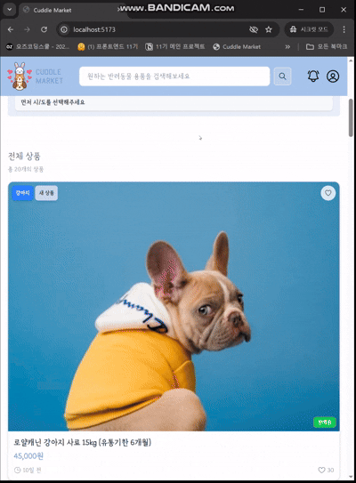
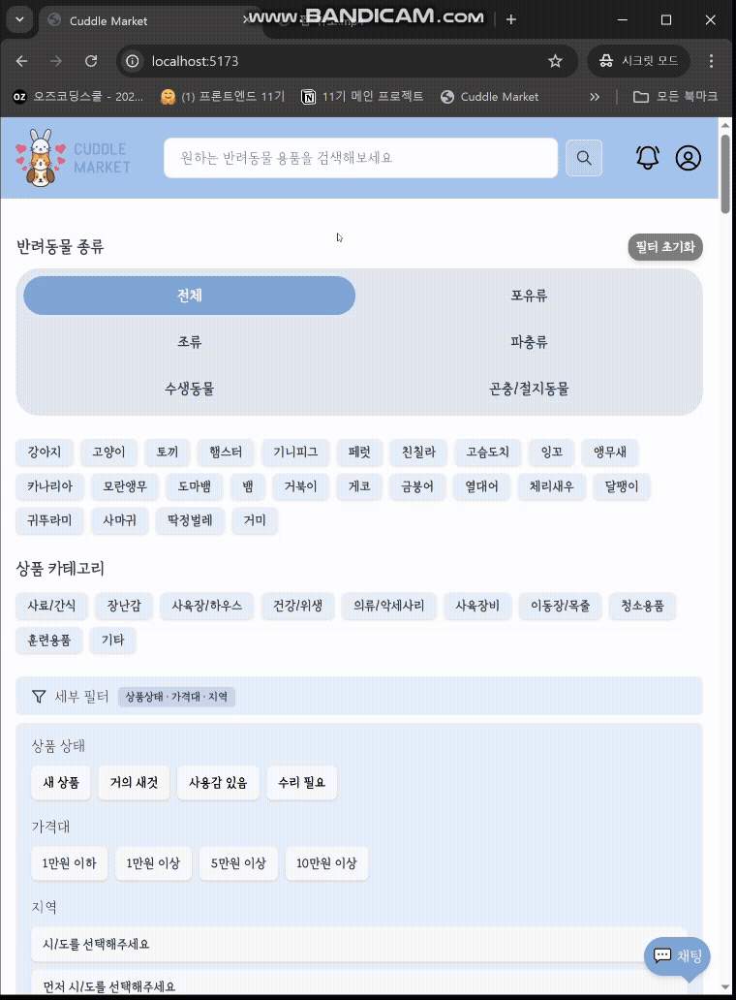
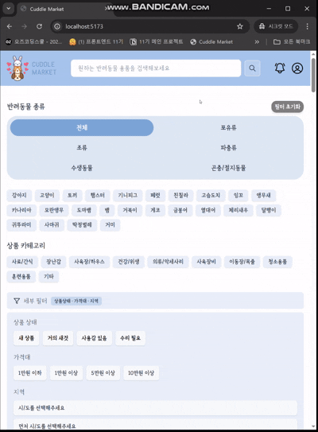
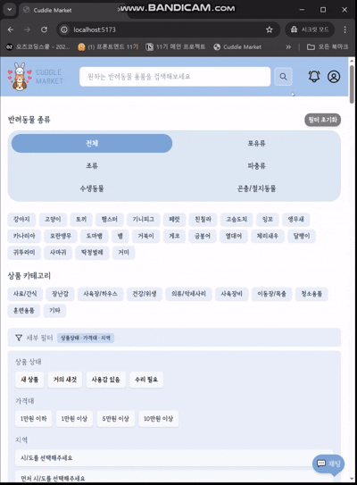

# CUDDLE MARKET

## 프로젝트 소개

 
 

 
<!-- CUDDLE MARKET는 반려동물을 사랑하는 사람들을 위한 반려동물 중고용품 웹 플랫폼입니다. 
더 이상 사용하지 않는 반려동물 용품을 쉽게 사고팔 수 있고, 다른 반려인들과 따뜻한 커뮤니티를 형성할 수 있습니다.
- 🐾 반려동물 용품의 합리적인 재사용
- 🐾 사용자 친화적인 간단한 UI/UX
- 🐾 따뜻한 감성을 담은 브랜드 아이덴티티 -->

**"더 이상 반려동물 용품은 한 번 쓰고 버리는 물건이 아닙니다."**

아이처럼 빠르게 성장하는 우리 반려동물들.  
금세 작아진 옷, 흥미를 잃은 장난감, 한두 번 쓴 캐리어...  
집 한구석에 쌓여가는 용품들을 보며 아까운 마음이 드셨나요?  

**CUDDLE MARKET**은 반려동물을 사랑하는 모든 가족들이 모여
따뜻한 마음을 나누는 동네 시장입니다.

반려동물이 사용했던 소중한 물건이 또 다른 새로운 기쁨이 되는 곳,
서로의 경험을 나누며 함께 성장하는 커뮤니티,

**CUDDLE MARKET에 오신 것을 환영합니다!**

<a href="https://cuddle-market-fe.vercel.app/">👉 cuddle market 바로가기</a>

## Final Web View

<table>
<thead>
<tr>
<th align="center">메인 화면</th>
<th align="center">소셜 로그인</th>
</tr>
</thead>
<tbody>
<tr>
<td align="center"></td>
<td align="center"></td>
</tr>
</tbody>
</table>
<table>
<thead>
<tr>
<th align="center">마이 페이지</th>
<th align="center">프로필 수정</th>
</tr>
</thead>
<tbody>
<tr>
<td align="center"></td>
<td align="center"></td>
</tr>
</tbody>
</table>
<table>
<thead>
<tr>
<th align="center">필터링</th>
<th align="center">상세 페이지</th>
</tr>
</thead>
<tbody>
<tr>
<td align="center"></td>
<td align="center"></td>
</tr>
</tbody>
</table>
<table>
<thead>
<tr>
<th align="center">찜하기</th>
<th align="center">찜 취소</th>
</tr>
</thead>
<tbody>
<tr>
<td align="center"></td>
<td align="center"></td>
</tr>
</tbody>
</table>
<table>
<thead>
<tr>
<th align="center">상품 등록</th>
<th align="center">상품 수정</th>
</tr>
</thead>
<tbody>
<tr>
<td align="center"></td>
<td align="center"></td>
</tr>
</tbody>
</table>
<table>
<thead>
<tr>
<th align="center">채팅</th>
<th align="center">로그아웃</th>
</tr>
</thead>
<tbody>
<tr>
<td align="center"></td>
  <td align="center"></td>
</tr>
</tbody>
</table>

## 사용 스택

### 🔧 System Architecture

//

### FE

 

 

### BE

///

## Team

<table>
<thead>
<tr>
<th align="center"> </th>
<th align="center"> </th>
<th align="center"> </th>
</tr>
</thead>
<tbody>
<tr>
<td align="center">총 팀장 (BackEnd 팀장)</td> 
<td align="center">부 팀장 (FrontEnd 팀장)</td>
<td align="center">팀원 (FrontEnd)</td>

</tr>
<tr>
<td align="center">권다연</td>
<td align="center">강주현</td>
<td align="center">김민제</td>

</tr>
</tbody>
</table>
<table>
<thead>
<tr>
<th align="center"> </th>
<th align="center"> </th>
<th align="center"> </th>

</tr>
</thead>
<tbody>
<tr>
<td align="center">팀원 (FrontEnd)</td>
<td align="center">팀원 (BackEnd)</td>
<td align="center">팀원 (BackEnd)</td>
</tr>
<tr>
<td align="center">김승원</td>
<td align="center">박강빈</td>
<td align="center">이상민</td>
</tr>
</tbody>
</table>

## Document

> <a href="">요구사항 정의서</a>  
<a href="https://github.com/ExpectedAnnualSalaryOf4TrillionWon/Cuddle-Market-FE/wiki/Flow-Chart">플로우 차트</a>  
<a href="https://github.com/ExpectedAnnualSalaryOf4TrillionWon/Cuddle-Market-FE/wiki/Wire-Frame">와이어프레임</a>  
<a href="">화면정의서</a> 
<a href="">ERD 문서</a>  
<a href="">테이블 명세서 문서</a>  
<a href="">API 문서</a> 

## More Info

<a href="">📚 Cuddle market Wiki</a> 
<a href="">🔐 Cuddle market Server Repository</a> 
